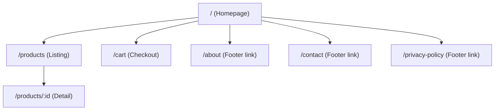
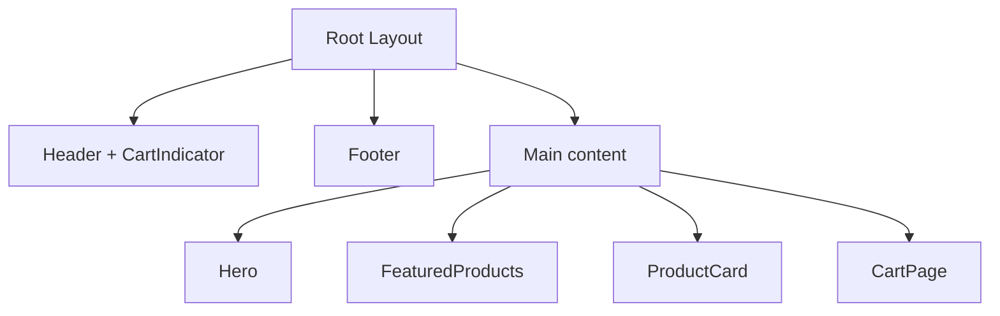

# Frontend Architecture

## 1) High-Level Setup

- **Framework**: Next.js (App Router) + TypeScript
- **API layer**: `lib/api/products.ts` (Fake Store API)
- **UI layer**: reusable components in `components/library`
- **Layout layer**: shared shell in `app/layout.tsx` (`Header`, `Footer`, cart context)

## 2) Website Architecture (Page Tree)

## 3) Component Hierarchy 

## 4) State Management

- **Server state**: products fetched in page routes (`getProducts`, `getProductById`, `getProductsByCategory`)
- **Client state**: cart handled with React Context (`CartProvider`)
- **Persistence**: cart stored in `localStorage`
- **URL state**: listing page uses query params for filter/sort/pagination

## 5) Routing Strategy

- File-based routes:
  - `/`
  - `/products`
  - `/products/[id]`
  - `/cart`
- Product Dispaly Page uses dynamic route param (`id`)

## 6) Performance Strategy

- Server-rendered route pages for fast first load
- API caching (`revalidate: 60`)
- Pagination on product list
- Reusable components to keep UI consistent and maintainable

## 7) Scaling

- Modular folders (`app`, `components`, `lib`, `types`) support growth
- Reusable `FeaturedProducts` pattern avoids duplicate feature components
- Cart context can later be replaced by backend cart API without major UI rewrite
